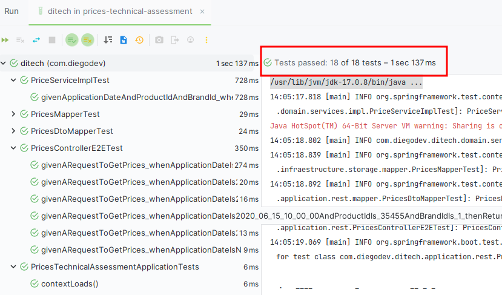
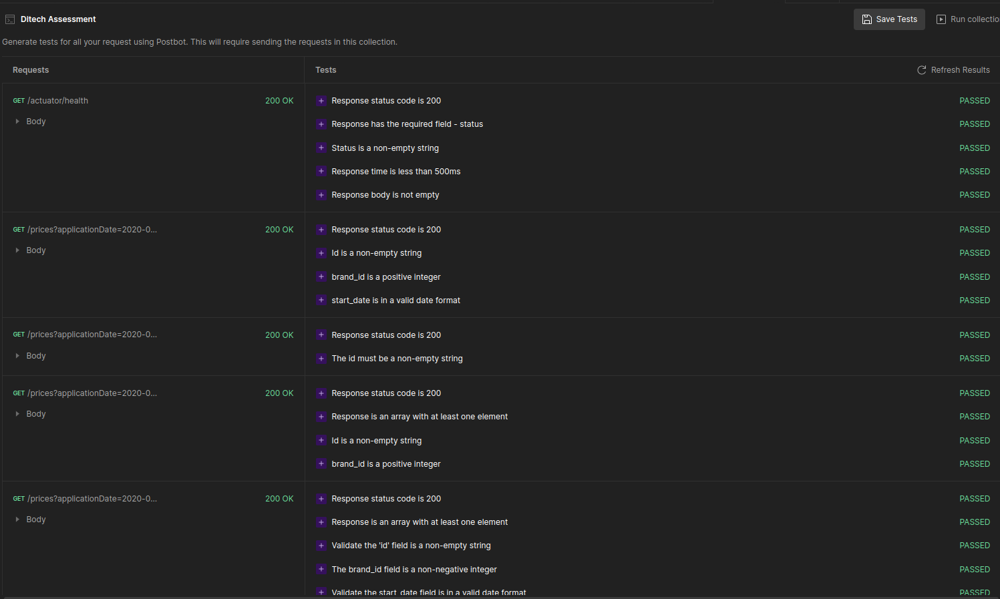

<h1 align="center"> Ditech Technical Assessment </h1>  

  

  Springboot technical assessment for Backend Engineer role @ Ditech

  

  

<!-- START doctoc generated TOC please keep comment here to allow auto update -->
<!-- DON'T EDIT THIS SECTION, INSTEAD RE-RUN doctoc TO UPDATE -->

## Table of Contents

- [Introduction](#introduction)
- [Technologies](#features)
- [Building](#feedback)
- [Testing](#contributors)
- [Docker](#build-process)
- [Results](#backers-)

<!-- END doctoc generated TOC please keep comment here to allow auto update -->

## Introduction

This project aims to develop a highly efficient and scalable microservice using cutting-edge technologies
while adhering to best practices in design and programming. The microservice will be containerized in a Docker
environment for portability and will be built following the hexagonal design pattern, SOLID principles,
and the DRY principle. Technologies include Spring Boot, Maven, H2 Database, Lombok, MapStruct,
and Liquibase, with an emphasis on separation of concerns and robust database schema management using Liquibase.

## Technologies

This project was done using Springboot, including some technologies such as:

* Java 17
* H2 Database
* Lombok
* Mapstruct
* Maven
* Liquibase

## Building

You can build the project with maven using:

`mvn clean install`

## Testing

You can run all unit tests within the project using:

`mvn test`

## Docker

This project contains a Dockerfile, so you can build the image and run containers from the project at your convenience.
If you want more information about building images and running containers please refer to [Docker Docs](https://docs.docker.com/)

## Results

Unit tests:

  

HTTP Requests tests:

  

You can find this requests collection in `src/test/resources/postman`
